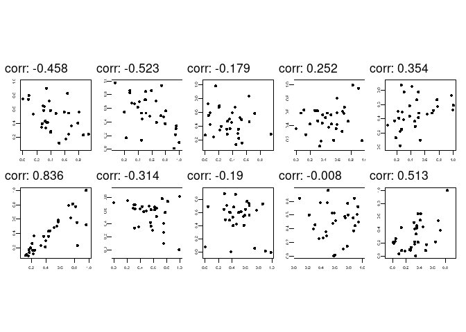

<!-- README.md is generated from README.Rmd. Please edit that file -->

# guessthecorrelation

<!-- badges: start -->

<!-- badges: end -->

A [{torch}](https://torch.mlverse.org/) dataset of [Curso-R’s Guess The
Correlation Dataset](https://www.kaggle.com/c/guess-the-correlation).

## Installation

``` r
remotes::install_github("athospd/guessthecorrelation")
```

``` r
library(guessthecorrelation)
library(tidyverse)
#> ── Attaching packages ─────────────────────────────────────── tidyverse 1.3.0 ──
#> ✓ ggplot2 3.3.2     ✓ purrr   0.3.4
#> ✓ tibble  3.0.4     ✓ dplyr   1.0.2
#> ✓ tidyr   1.1.2     ✓ stringr 1.4.0
#> ✓ readr   1.3.1     ✓ forcats 0.5.0
#> ── Conflicts ────────────────────────────────────────── tidyverse_conflicts() ──
#> x dplyr::filter() masks stats::filter()
#> x dplyr::lag()    masks stats::lag()
```

``` r
train <- guess_the_correlation_dataset(root = "~/datasets", token = "kaggle.json", download = TRUE, split = "train")
submition <- guess_the_correlation_dataset(root = "~/datasets", token = "kaggle.json", download = TRUE, split = "submition")
```

``` r
transform <- function(x) {
  x
}

plot_one_img <- function(idx) {
  train[idx]$x %>%
  transform() %>%
  as.array() %>%
    as_tibble() %>%
    rowid_to_column(var = "Y") %>%
    gather(key = "X", value = "value", -Y) %>%
    mutate(X = as.numeric(gsub("V", "", X))) %>%
    ggplot(aes(X, rev(Y), fill = value)) +
    geom_raster() +
    theme_void() +
    theme(legend.position = "none") +
    theme(aspect.ratio = 1) +
    ggtitle(glue::glue("corr: {round(train[idx]$y, 3)}")) +
    scale_fill_gradient(high = "white", low = "black")
}

library(patchwork)
map(1:10, plot_one_img) %>% reduce(`+`) + plot_layout(ncol = 5)
#> Warning: The `x` argument of `as_tibble.matrix()` must have unique column names if `.name_repair` is omitted as of tibble 2.0.0.
#> Using compatibility `.name_repair`.
#> This warning is displayed once every 8 hours.
#> Call `lifecycle::last_warnings()` to see where this warning was generated.
```


